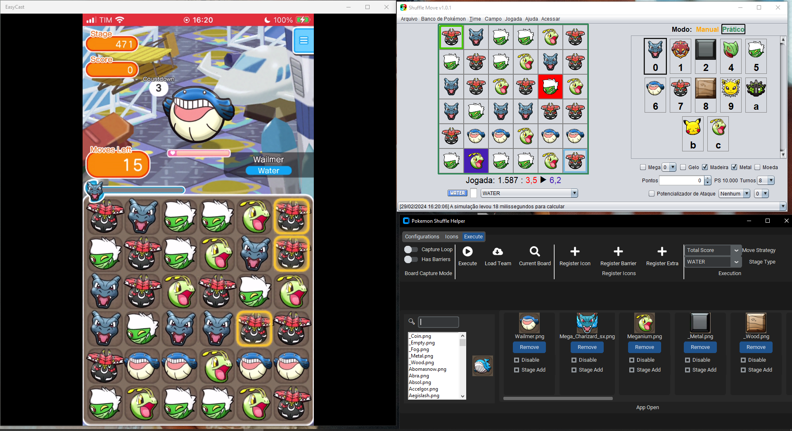

# Shuffle Move Helper

This app helps with the filling of the Shuffle Move Team and Board to speed up-some simple and fast Pokemon Shuffle Plays.

I made a video showing how to properly use the app: [Youtube Tutorial Link](https://youtu.be/dj1tD3g5shQ)

## Getting Started

### Dependencies

* I only have Windows, so I'm not sure if it will work on other OS.

* Modified Version of the shuffle move, found in my fork from the official version here: [Shuffle Move](https://github.com/Fvegini/Shuffle-Move) 
* Some app to mirror you phone screen to your computer, the ones I tested are:
    * EasyCast
    * Air Screen Mirroring Receiver
    * AirDroid Cast

### Installing

* Just download the latest version from the release, extract and run the .exe file (The exe depends on the assets folder inside the zip, they need to be on the same folder to work)
* For Python enthusiasts, you just need to install the `requirements.txt` dependencies and run the `app/main.py` file.

### How It Works

This program relies entirely on the Shuffle Move configuration files to work. It overrite the files that control the current team and current board of the Shuffle Move, then send a code to the shuffle "reload all files", and this action make it recalculate the next "best move".

To match the "current board icon" with the "correct pokemon" I'm using a tflite model that I randomly downloaded from the internet, then I use cosine similarity to find the best match.

I used the Shuffle Move asset lists merged with some background images that I recorded with my phone to make the final list. Some pokemon are better matched than others and the barrier ones is a pain. To outline this I created two methods to "Save the current image as Pokemon", this way you can increment the database with "new" pokemons.

My initial idea was to use the Shuffle Move as some sort of backend API and remove the UI entirely, but I couldn't figure out a way to do it (I suck at java), and the way I could make it work was open a port to a websocket, this way I could easily send a command to trigger the "load all" function.

### Executing program

The main idea is pretty simple, open the three apps (Screen Mirror, Shuffle Move and Shuffle Move Helper), configure your team on the Helper and click in the "Execute" Button (F2) to make it fill the Shuffle Move board. Then look at the Shuffle Move screen suggested play (Move Red to Blue to activate the proper skill) and repeat.

I Usually set my screen mirror on the left side of the screen, Shuffle Move on the right upper side and the Helper on the right lower side as displayed on the screen below

## Functions

Configuration - Board Position: This button is to select where on the screen will be your Pokemon Shuffle Board, you must click on the top-left position of the board and drag until the lower right position then left the mouse. It will open a window showing how the board was splitted with the selection you made. You should retry this until all the icons are relatively well centered.

## Authors

Felipe Francesco Ramthum Vegini

## Version History

* 0.2
    * Updated to fill the Shuffle Move configuration files and call the websocket method to reload them.
* 0.1
    * Initial Release using original Shuffle Move and clicking and typing manually the pokemons on the board
